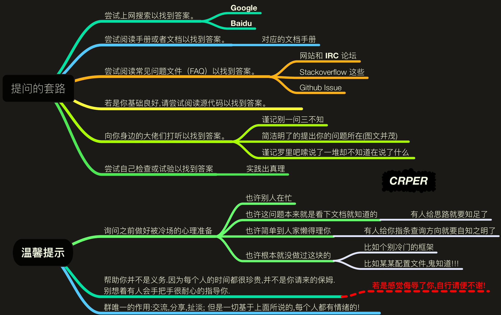

## 《提问的智慧》&《别像弱智一样提问》读后感

> 参考文章：
> 1. [《提问的智慧》| Github](https://github.com/ryanhanwu/How-To-Ask-Questions-The-Smart-Way/blob/main/README-zh_CN.md)
> 2. [《别像弱智一样提问》| Github](https://github.com/tangx/Stop-Ask-Questions-The-Stupid-Ways/blob/master/README.md)

### 1 文章复盘

《提问的智慧》一文中对提问的方法以及不同场景进行了详尽的回答，鄙人也受益匪浅。同时，《别想弱智一样提问》用简洁明了的字句描述了提问的套路以及反复强调提问者明确自己的位置，需要在双方互相尊重的基础上建立起沟通。

我认为，简洁、精确的描述自己的问题不止有助于问题的解决，也是对解答者的尊重。

### 2 关于好的提问

我在初中、高中、大学期间，向他人提问、解答过不少问题。按照我最不想回答问题的排名，大致可以分为如下几类：
1. 想得到问题A的解答，但询问中间问题B：这一类问题主要伴随着提问者的突然袭击以及不完整的前置信息，此时双方信息已然不对称，而提问者却大概率不自知，沉浸在自己的世界中，这样的提问肯定是低效的；
2. 想得到问题A的解答，反驳提问者的解答A并给出自己的解答B：这一类问题主要伴随着提问者极短的脑回路以及傲慢的态度，提问者并没有义务去陪解答者玩过家家，作为问题的提出者肯定是比解答者更为熟悉的，无论是否需要解答者的回答，都需要保持谦卑的态度；
3. 想得到问题A的解答，但表达出询问问题B：这一类问题主要伴随提问者那惨不忍睹的口头表达能力及粗放的提问态度，此时提问者可能自己对问题本身是较为清晰的，但无法将信息有效传达给解答者，若想真正解决问题，需要让提问者整理好相关信息并作清晰的展示（但提问者一般会拒绝）；
4. 想得到问题A的解答，但询问AAAAAAA：这一类问题主要伴随着提问者聒噪的重复提问，对于视听觉完好的解答者，这种噪声会影响解答者对问题本身的思考，需要请提问者耐心等候。

一个好的提问在我看来应该具有如下因素：
1. 在提问前已经被较为详细的思考：换句话说，只有思考过问题的提问者才能一阵见血地指出问题要点；
2. 直观、准确的信息载体：报错截图、文本描述需要清晰、齐全，一两句以内总结问题本身；
3. 专业对口且能给予解答者思考：好的提问是对解答者过去知识的一次整合，较为有难度的领域内问题会促进双方的进步。

### 3 关于独立解决问题

个人认为对于计算机专业的学生，独立解决问题能力是必备的。具体来说应该有：
1. 信息检索能力：在斑驳繁杂的网络信息中寻找到与问题相匹配、较为准确的回答；
2. 信息整合能力：将收集来的信息特化到自己的问题实例中，对症下药，设计针对性解决方案；
3. 执行与复盘能力：能落实上述方案，并对这一次问题解决方式进行复盘、改进。

总而言之，独立解决问题的能力不止能提升科研或学习效率，同时也为如何向他人高效提问作出铺垫。