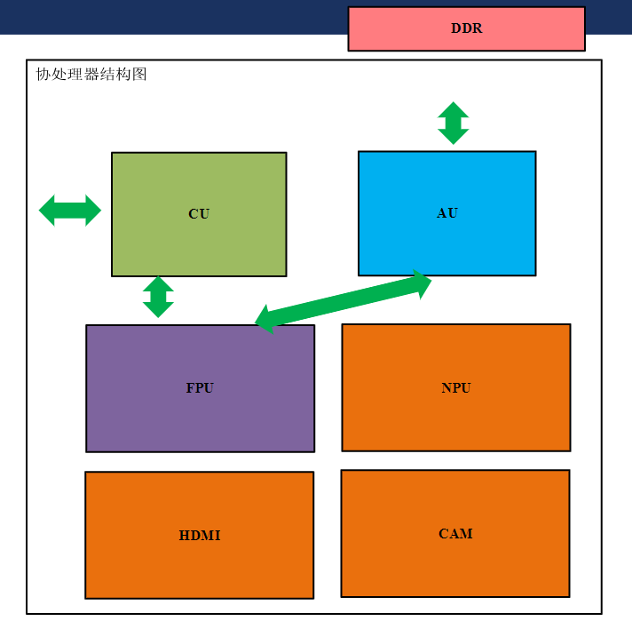
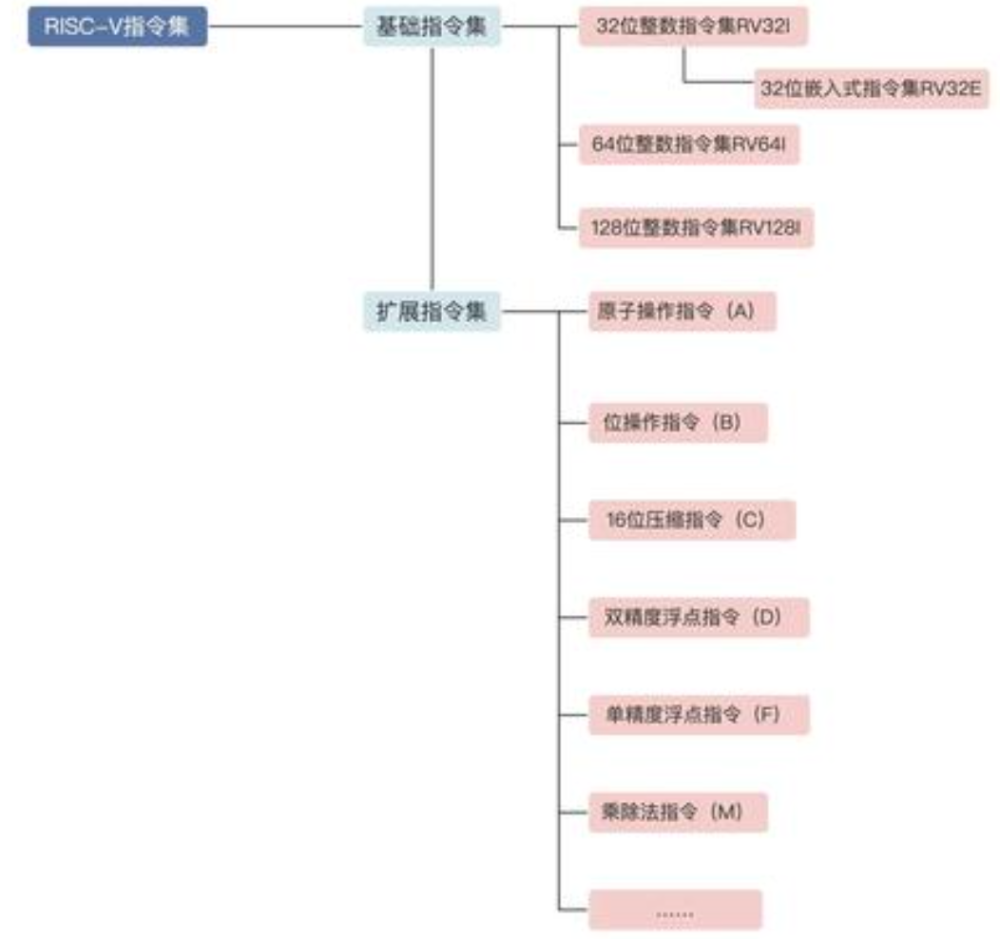
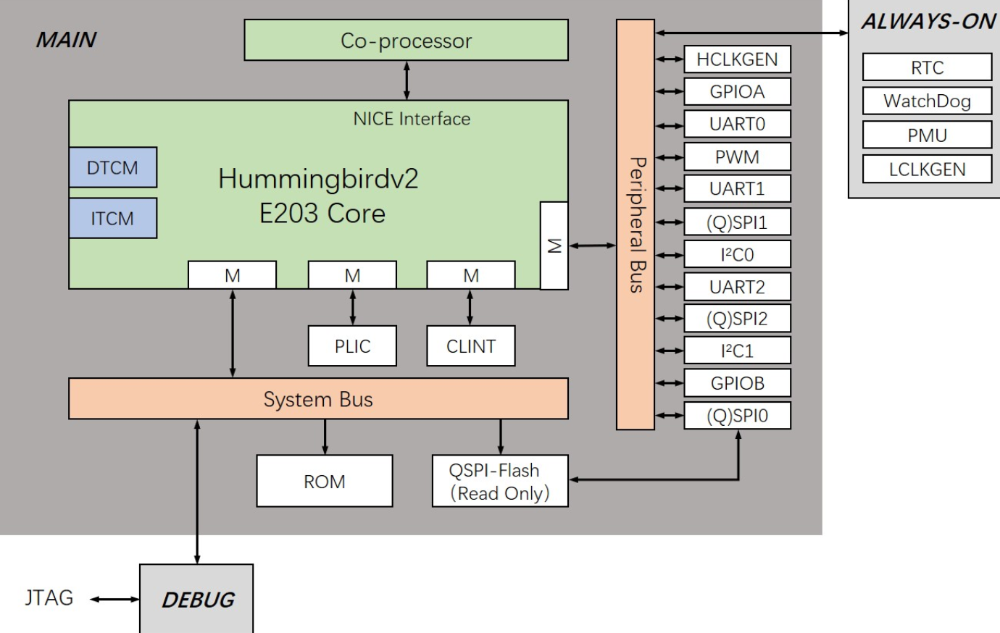
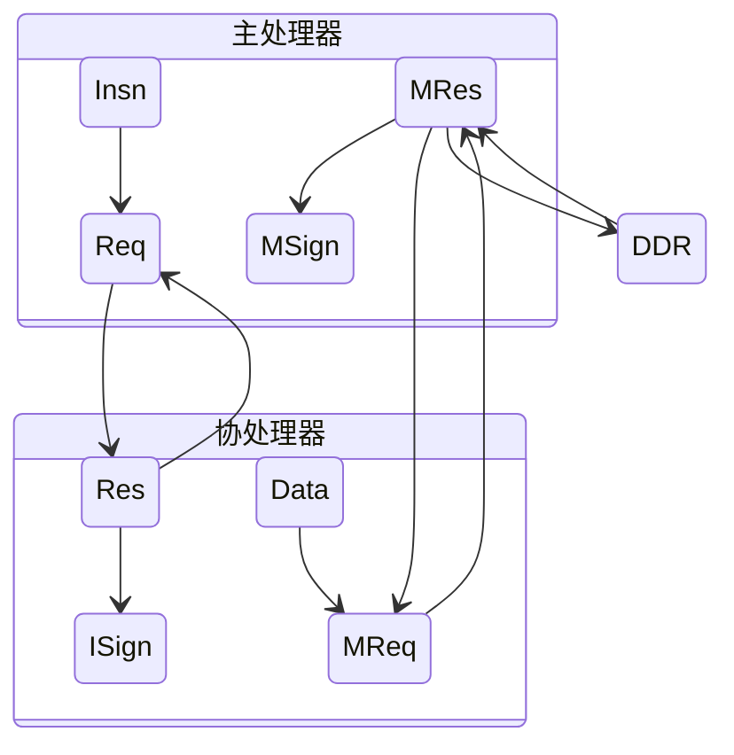
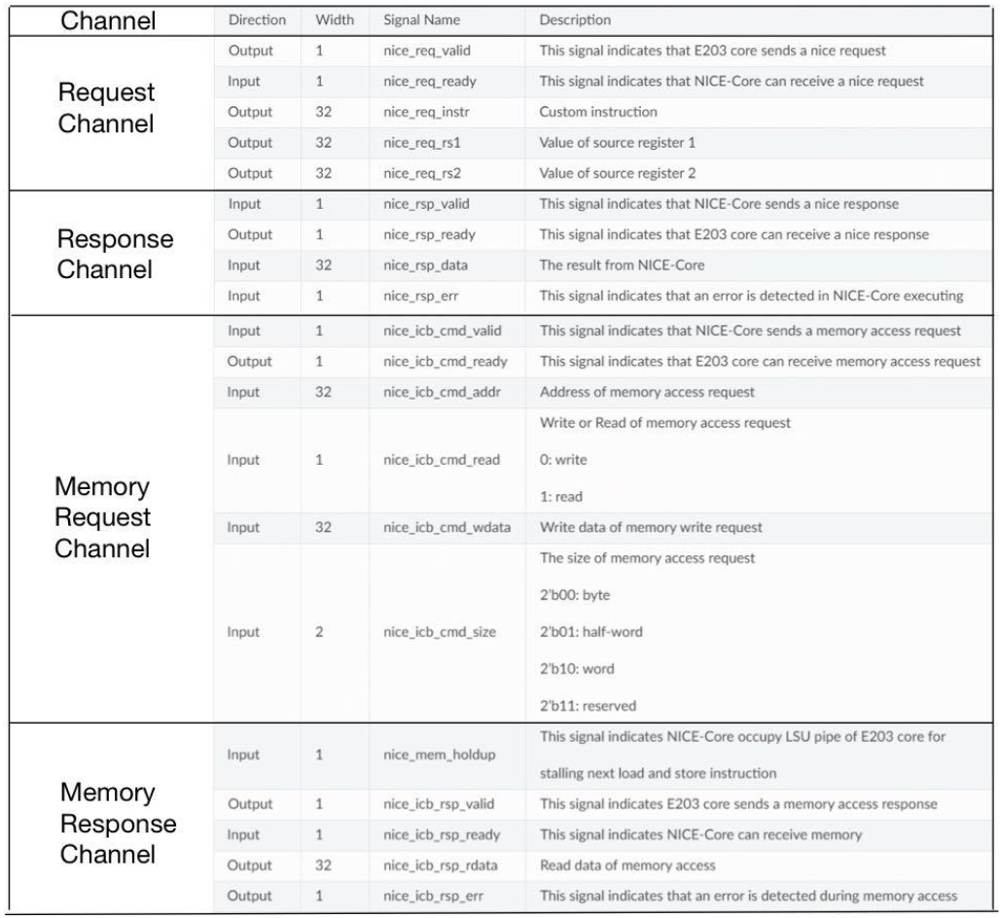
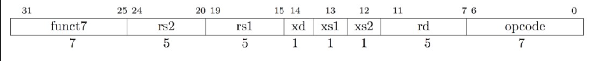

# FPU 协处理器与扩展指令

<hr>

> [中国研究生创芯大赛](https://cpipc.acge.org.cn/cw/hp/10)

<hr>

> 2024/05/19


---

# 1 相关概念


----

## 1.1 协处理器

协处理器基本架构如下图所示：


----

### 1.1.1 CU
CU（*Control Unit*）：**控制单元**，负责指导和协调整个处理器的工作流程。CU解码指令、控制数据流、管理寄存器和执行单元之间的数据传输，确保指令按照正确的顺序和时间执行

----

### 1.1.2 AU

AU（*Arithmetic Unit*）：**算术单元**，负责执行算术运算，包括加法、减法、乘法、除法等数值计算操作。AU通常包括整数运算单元（Integer Unit）和浮点运算单元（Floating Point Unit），用于处理整数和浮点数的运算。

----

### 1.1.3 FPU

FPU（*Floating Point Unit*）：**浮点运算单元**，是处理器中的一个专门模块，用于执行浮点数的运算操作。FPU 负责执行诸如加法、减法、乘法、除法以及其他浮点数运算的操作。

----

### 1.1.4 NPU

NPU（*Neural Processing Unit*）：**神经网络处理单元**，专门用于执行神经网络推理和训练任务的硬件加速器，具有高效、并行、低功耗和定制化等特点。

----

### 1.1.5 Others

DDR（*Double Data Rate*）是一种内存类型，它在每个时钟周期传输两次数据，从而实现了比传统内存更高的数据传输速率。DDR 内存通常用于计算机系统中作为主存储器，用于存储程序和数据。DDR 内存的速度通常以频率（例如 DDR3-1600、DDR4-3200）来表示，表示每秒传输的数据次数。

CAM（*Content-Addressable Memory*）是一种具有快速查找功能的存储器，它能够根据数据内容来查找存储的数据，而不是根据地址。CAM 内存通常用于高速缓存、路由表和网络设备中的数据查找操作，以提高查找速度和效率。

HDMI（*High-Definition Multimedia Interface*）是一种数字化音视频接口标准，用于传输高清晰度音视频信号。HDMI 接口通常用于连接电视、显示器、投影仪、游戏机、计算机等设备，以实现高质量的音视频传输和显示。HDMI 接口支持多种分辨率和音频格式，并可以通过单一的电缆传输音视频信号和其他数据。

----

## 1.2 RISC-V 指令集

RISC-V 是一款开源指令集，其设计简洁高效模块化，适用于各种应用场景，并有良好的可移植性和可扩展性。RISC-V 指令集包括基本指令和拓展指令，这些指令被设计用于执行各种计算任务和操作。



----

### 1.2.1 基本指令

整数指令集 I 包括算术、逻辑、分支、访存（访问内存）指令等，已经可以实现一个完整的软件栈。根据寄存器位宽和地址空间不同，其分为32、64、128位三种不同类型。

----

### 1.2.2 拓展指令

若CPU有更多的功能要求，可以在基础指令的基础上组装扩展指令，扩展指令主要有以下这些：
- M：乘除法、取模求余指令
- F：单精度浮点指令
- D：双精度浮点指令
- Q：四倍浮点指令
- A：原子操作指令，例如常见的cas（compare and swap）指令
- C：压缩指令，主要用于改善程序大小
- G：= I+M+A+D+F，表示通用处理器所包含的指令集

----

### 1.2.3 指令格式

RISC-V指令根据格式特点可以分为六种类型（Type）：
- R Type：用于寄存器——寄存器之间的操作 （Register）
- I Type：短立即数及内存访问操作（Immediate）
- S Type：用于内存store操作 （Store）
- B Type：用于条件跳转操作 （Branch）
- U Type：用于长立即数操作
- J Type：用于无条件跳转操作 （Jump）


----

### 1.2.3 指令格式


----

## 1.3 蜂鸟 E203

蜂鸟 E203 是一款基于 RISC-V 开源指令集架构的处理器，其 CPU 核心通过实现 RISC-V 指令集，实现了高性能、低功耗、可拓展的处理能力，适用于各种嵌入式系统和物联网设备。




----

### 1.3.1 总线架构

E203 使用了 **nice 总线**作为内部总线架构，nice 总线具有低延迟、高吞吐量的特点，能够有效地连接 CPU、内存、外设等各个部件，实现指令或数据的快速传输和处理。

E203 支持**指令拓展功能**，可以根据具体的应用需求扩展和优化指令集，以提高处理器的性能和功能。通过指令拓展功能，可以实现针对特定应用场景（如浮点并行加速）的优化指令，加速特定算法和操作的执行，从而提高整体系统的性能和效率。

---

# 2 协处理流程

----

## 2.1 基本流程

蜂鸟 E203 通过 nice 总线中的通道将主处理器上的R型拓展指令传输到协处理器，协处理器执行拓展指令，数据写入DDR，并将处理结果传回主处理器。




----
### 2.1.1 通道

1. 请求通道【主->协】（*Request Channel*）：主处理器处于流水线 EXU 级时解码到 R型拓展指令，向协处理器发送请求，并将指令的编码信息和源操作数传输到协处理器。
2. 反馈通道【协->主】（*Response Channel*）：协处理器执行拓展指令，执行完毕传输回主处理器反馈结果。
3. 存储器请求通道【协->主】（*Memory Request Channel*）：协处理器向主处理器发送存储器读写请求，将运算结果传输到存储器。
4. 存储器反馈通道【主->协】（*Memory Response Channel*）：主处理器向协处理器发送存储器读写结果。

----

### 2.1.2 通道参数

> 通道参数：
> 

---

# 3 项目说明

----

## 3.1 项目目标

项目目标：通过给蜂鸟 E203 添加协处理器，设计 R 型拓展指令与 NMS 算法，实现对图像目标检测算法的加速。

项目细则：
1. 软件部分：
   1. RISC-V R型指令设计
   2. NMS 算法设计
   3. 软件功能验证
2. 硬件部分：
   1. AU 组件设计
   2. CU 组件设计
   3. FPU 组件设计
   4. 硬件上版验证
3. 对比实验：
   1. 数据集
   2. 评价指标

----

## 3.2 软件部分

----

### 3.2.1 NICE指令格式

为了方便用户扩展自定义指令，RISC-V ISA在32位指令中预定义了4组自定义指令类型（Custom-0、Custom-1、Custom-2、Custom-3），每组都有自己的操作码。

```
Custom-0:
........ ........ ........ .00010..
Custom-1:
........ ........ ........ .01010..
Custom-2:
........ ........ ........ .10110..
Custom-3:
........ ........ ........ .11110..
```

----

### 3.2.2 自定义指令设计

在 E203 Core 中，用户可以使用这 4 个自定义指令组（Custom-0、Custom-1、Custom-2、Custom-3）进行 NICE 扩展，下图显示了 NICE 指令格式的详细信息：


| 域 | 描述 |
|:--:|:---:|
| opcode | 选择 Custom 指令 |
| rd | 目的寄存器索引 |
| xs2 | 设置该值：rs2会被读入 |
| xs1 | 设置该值：rs1会被读入 |
| xd | 设置该值：rd会被写入 |
| rs1 | 源操作数 1 的索引 |
| rs2 | 源操作数 2 的索引 |
| funct7 | 自定义 7 位操作码 |

----

### 3.2.3 NICE指令设计


| 指令 | 功能 | 编码 |
|:---:|:---:|:---:|
| insn1 | 将数据写入FPU的Buffer内 | `.insn r 0x7b, 1, 1, %0, %1, %2` |
| insn2 |  |  |
| insn3 |  |  |
| insn4 |  |  |
| insn5 |  |  |
| insn6 |  |  |

----

### 3.2.4 具体代码

```c
// insn.h
#ifndef __INSN_H__
#define __INSN_H__

#include <hbird_sdk_soc.h>

// ============================================================================= //
//                       Design of R-Type FPU Instructions
// ============================================================================= //

// custom insn1: Write data to FPU Buffer.
// rs1: Register index of source data address
// rs2: Register index of source data length (0 : 128 : 2048)
__STATIC_FORCEINLINE uint32_t custom_insn1(uint32_t rs1, uint32_t rs2) {
	// Set no rd return: zero register
	int zero = 0;
    asm volatile (
    // .insn r opcode, func3, func7, rd, rs1, rs2
       ".insn r 0x7b, 1, 1, %0, %1, %2"
             :"=r"(zero)
             :"r"(rs1), "r"(rs2)
     );
	return 1;
}

// custom insn2: Add two floats in FPU, and get result.
// rs1: Register index of source data address
// rs2: Register index of result of two floats' addition
__STATIC_FORCEINLINE uint32_t custom_insn2(uint32_t rs1, uint32_t rs2) {
	// Set no rd return: zero register
	int zero = 0;
    asm volatile (
    // .insn r opcode, func3, func7, rd, rs1, rs2
       ".insn r 0x7b, 1, 2, %0, %1, %2"
             :"=r"(zero)
             :"r"(rs1), "r"(rs2)
     );
	return 2;
}

// custom insn3: Get softmax result from FPU.
// rs1: Register index of result of softmax layer addition
__STATIC_FORCEINLINE uint32_t custom_insn3(uint32_t rs1) {
	// Set no rd return: zero register
	int zero = 0;
    asm volatile (
    // .insn r opcode, func3, func7, rd, rs1, rs2
       ".insn r 0x7b, 1, 3, %0, %1, x0"
            :"=r"(zero)
             :"r"(rs1)
     );
	return 3;
}


// custom insn4: Define if use FPU float2fixed-point module.
// rs1: Bool value (0: No Use, 1: Use)
__STATIC_FORCEINLINE uint32_t custom_insn4(uint32_t rs1) {
	// Set no rd return: zero register
	int zero = 0;
    asm volatile (
    // .insn r opcode, func3, func7, rd, rs1, rs2
       ".insn r 0x7b, 1, 4, %0, %1, x0"
             :"=r"(zero)
             :"r"(rs1)
     );
	return 4;
}

// custom insn5: Load data from DDR. (DDR -> Mem)
// rs1: Register index of data address in memory. (Where to write data. len: 128 word = int[128])
// rs2: E203 array index. (Where to fetch data)
__STATIC_FORCEINLINE uint32_t custom_insn5(uint32_t rs1, uint32_t rs2) {
	// Set no rd return: zero register
	int zero = 0;
    asm volatile (
    // .insn r opcode, func3, func7, rd, rs1, rs2
       ".insn r 0x7b, 1, 5, %0, %1, %2"
            :"=r"(zero)
            :"r"(rs1), "r"(rs2)
     );
	return 5;
}

// custom insn6: Write data to DDR. (Mem -> DDR)
// rs1: Register index of data address in memory. (Where to fetch data. len: 128 word = int[128])
// rs2: E203 array index. (Where to write data)
__STATIC_FORCEINLINE uint32_t custom_insn6(uint32_t rs1, uint32_t rs2) {
	// Set no rd return: zero register
	int zero = 0;
    asm volatile (
    // .insn r opcode, func3, func7, rd, rs1, rs2
       ".insn r 0x7b, 1, 6, %0, %1, %2"
            :"=r"(zero)
            :"r"(rs1), "r"(rs2)
     );
	return 6;
}


#endif
```

---

## 参考资料

> 1. [RISC-V ISA Manual | Github](https://github.com/riscv/riscv-isa-manual)
> 2. [RISC-V 指令集介绍 | Zhihu](https://zhuanlan.zhihu.com/p/558799873)
> 3. [蜂鸟E203协处理器参考示例](https://www.rvmcu.com/community-topic-id-340.html)
> 4. [NucleiStudio 和 vivado 软硬件联合仿真](https://www.rvmcu.com/community-topic-id-386.html)
> 5. [蜂鸟 E203 介绍](https://doc.nucleisys.com/hbirdv2/overview/overview.html)
> 6. [纯C实现NMS算法 | CSDN](https://blog.csdn.net/qq_41384531/article/details/126183162)

---

# Thanks!