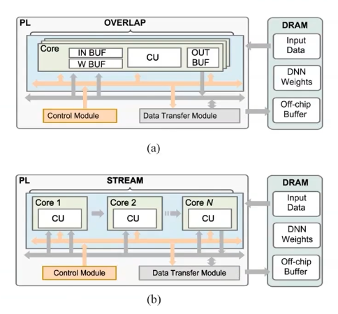
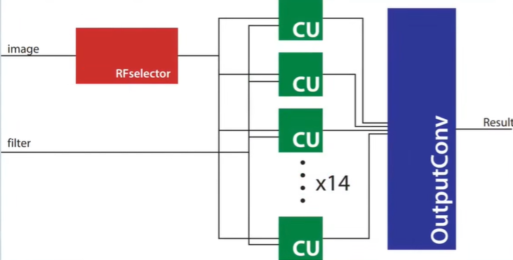
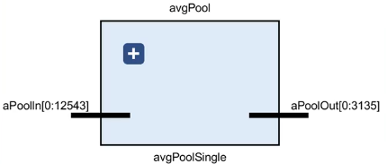

# 神经网络加速器设计

<hr>

> [LancerStadium](https://github.com/LancerStadium)

---

# 1 方案设计

---

## 1.1 加速指标

对于神经网络加速器来说，需要考虑的主要指标有：

+ 并行度：与计算速度和资源占用成正比；
+ 计算速度：与并行度和资源占用成正比；
+ 资源占用：与并行度和计算速度成正比；

<hr>

**目标**：最大化计算速度，最小化资源占用。


----

## 1.2 加速模拟

加速器验证思路：

1. 使用`Python/C++`编写模块相同功能函数；
2. 为硬件模块与软件函数搭建对应`testbench`，记录模拟结果；
3. 对比两者输出数据是否一致（随机抽样验证）；
4. 若发现错误，修改模块，并重新验证。

----

## 1.3 关键算子

+ 浮点：`addf16`, `mulf16`
+ 矩阵：`mulmat`
+ 层：`softmax`, `laternorm`


----

## 1.4 加速方案

+ 查表法：查表法是一种常用的加速算法，它通过提前计算并存储某些数据或结果，然后在需要时直接查表获取结果，从而避免重复计算。这种方法通常用于需要频繁进行某些固定计算的场景，可以显著提高计算效率。
+ cordic：CORDIC（*Coordinate Rotation Digital Computer*）算法是一种用于计算三角函数、对数和其他数学函数的快速算法。它通过迭代地进行坐标旋转和移位运算来逼近目标函数值，是一种高效且精确的计算方法。CORDIC算法在数字信号处理、通信系统等领域广泛应用，并且在硬件实现上具有很高的效率。

----

## 1.5 加速器分类

+ 单PE加速器（*Single Processing Engine*）：脉动阵列处理每一层网络，使用共享资源对不同层加速，兼容性强，延迟性大。**重叠模式**（*Overlap Pattern*）。
+ 流式加速器（*Steam Architecture*）：流式处理，使用不同资源对不同层独立加速，兼容性弱，延迟性小。**流模式**（*Stream Pattern*）



++++


对于重叠模式下的架构：这些PE算子可跨层复用，但使用了片外DDR，由PS与PL通信控制，计算延迟受限于通信带宽。

<hr>


++++

其他加速器：

+ 向量处理器（*Vector Processor*）：卷积向量算子硬件化（平方、除法、乘积），本质是单PE。
+ 神经突触处理器（*Neurosynaptic Processor*）：针对CNN处理器，存算一体，网络映射难度较大。


----

## 1.6 PS & PL


+ 交互：`gp`, `hp`, `ready-valid`
+ 数据：`reg_ctrl`, `dma`

<hr>


----

## 1.7 浮点量化

半精度浮点数`float16`：常用于实现加速器中的浮点数运算。其结构：

+ 符号S：1  bit
+ 指数E：5  bit
+ 尾数M：10 bit

```
    |S|   E   |     M     |
  16| |14   10|9         0|

    FP16 = (-1)^S * 1.M * 2^(E - 15) 
    Range: [5.96*10^-8, 6.55*10^4]
```

++++

## 1.7 整型量化


----

## 1.8 低功耗设计

待定

---

# 2 模块加速

----

## 2.1 Conv模块加速

对卷积层进行模块分解：

+ 顶层：`ConvLayer`卷积层模块
+ 激活函数：`Tanh`激活函数、 `Softmax`激活函数
+ 池化层：`AvgPool`平均池化层
+ 算子：
  + 浮点：`mulf16`半精度浮点乘、`addf16`半精度浮点加

----

### 2.1.1 Convolution Layer

一个卷积层有多个卷积核（*Filter*），image输入到不同的核得到不同的特征（*Feature*），**自顶向下**先观察`Multi Filter Layer`，其输入图像和六个卷积核，输出卷积结果。

网络`ConvLayerMulti`层输入矩阵规模：`image 32*32, filterSet 5*5`

<hr>


++++

模块`ConvLayerMulti`层输入：
```
    image:       1 *        32 * 32 *   16   = 16384  
    filters:     6 *        5 * 5 *     16   = 2400
    outputConv:  1 *        28 * 28 *   16   = 12544
                 ^ channel  ^ scale     ^ bitwidth
```

<hr>


++++

对于单个卷积核（*Filter*），再观察`Single Filter Layer`，其输入图像和单个卷积核，输出特征图（*Feature Map*）。

<hr>




++++

模块`ConvLayerSingle`层输入：
```
    image:       1 *        32 * 32 *   16   = 16384 
    filters:     1 *        5 * 5 *     16   = 400
    outputConv:  1 *        28 * 28 *   16   = 12544
                 ^ channel  ^ scale     ^ bitwidth
```

<hr>


----

### 2.1.2 Convolution Unit

一个卷积核（*Filter*）与一个输入图像（*Image*）进行卷积运算，得到特征图（*Feature Map*），这个过程通过`ConvUnit`模块实现。

<hr>


++++

`CU`模块循环使用`PE`模块实现一个窗口的卷积操作，并输出一个半精度浮点型（*FP16*）计算结果。<red>注意：循环使用`PE`牺牲了速度换面积。</red>

<hr>


----

### 2.1.3 Processing Element

卷积进行的具体操作是**点乘**，这里本质上是浮点算子：`mulf16`乘、`addf16`加，这里通过`PE`模块实现。

<hr>


++++

元素处理（*PE*）模块：执行具体卷积操作，即权重与数据相乘后累加。添加`result_reg`，将电路从组合逻辑转化为时序逻辑，保证数据同步。

<hr>


++++

元素处理（*PE*）模块代码演示：

```verilog

module PE(
    clk, rst,
    fA, fB, res
);
    parameter DATA_WIDTH = 16;  // 数据位宽

    input clk, rst;
    input [DATA_WIDTH-1:0] fA, fB;
    output reg [DATA_WIDTH-1:0] res;

    wire [DATA_WIDTH-1:0] mul_res;
    wire [DATA_WIDTH-1:0] add_res;

    // 1. 计算乘法结果
    mulf16 FMUL(.fA(fA), .fB(fB), .res(mul_res));
    // 2. 计算累加结果
    addf16 FADD(.fA(fA), .fB(fB), .res(add_res));

    always @(posedge clk or posedge rst) begin
        if(rst == 1'b1) begin
            res <= 0;
        end else begin
            res <= add_res;
        end
    end
endmodule

```
----

### 2.1.4 Softmax Layer

`Softmax`函数将输入归一化，求得各个类概率。输入规模与输出规模相同（400）。

<hr>


++++

计算过程（时序逻辑）：

1. 指数计算：将多个输入分别送到各自的`exponet`求指数，
2. 计算指数和：加法器累加
3. 求指数和倒数：使用`FloatReciprocal`计算
4. 得到每个元素softmax值：乘法器计算


----

### 2.1.5 Exponent

指数模块`exponent`，求解$e^x$值，输入规模与输出规模相同（32），使用泰勒展开拟合：

$$
    e^x = 1 + x + \frac{x^2}{2!} + \frac{x^3}{3!} + \frac{x^4}{4!} + \cdots
$$

> - 两个乘法器：分子 & 分母。
> - 一个加法器：累加。

----

## 2.2 Pool模块加速

对平均池化层分解：

+ 顶层：`AvgPoolMulti`（通道平均池化）
+ 中间层：`AvgPoolSingle`（单通道平均池化）
+ 底层：`AvgU`（平均池化单元）

----

### 2.2.1 Average Pool Layer

多通道平均池化层（*Average Pool Multi*）并行度为1，循环使用`AvgPoolSingle`完成所有通道的平均池化。(时序逻辑电路)

<hr>


++++


单通道平均池化（*Average Pool Single*）：全并行度，每个窗口都有一个`AvgU`运算模块。（组合逻辑电路）

<hr>



----

### 2.2.2 Averaging Unit

平均池化单元（*AvgU*）：每个通道的平均池化操作：求输入的四个数（位宽16 * 4）的均值，先求和，再乘以0.25得到均值（位宽16）。（组合逻辑电路）

+ 三个加法器：numAdd = numA + numB + numC + numD
+ 一个乘法器：numAvg = 0.25 * numAdd

> 优化：插入寄存器形成pipline。

----

## 2.2 FC模块加速

对全连接层分解：

+ 顶层：`FCMulti`（通道全连接）
+ 中间层：`FCSingle`（单通道全连接），激活函数为`Tanh`
+ 底层：`PE`计算模块

----

### 2.2.1 FC Layer

全连接层（*Full Connection Layer*）：进行线性计算，矩阵向量乘，向量和。

$$
    y = xW^T + b
$$

> 注意：多层之间加上`Tanh`非线性激活函数。

----

### 2.2.2 PE

`PE`是一个乘法器和加法器实现，实现累乘和累加。

<hr>


---

# 3 项目概览

----

## 3.1 项目目录

参考如下`CNN`加速器目录：

```
.
├── vivado_project          # 项目完整网络的vivado工程
├── conv_code               # 不同并行度的卷积模块代码
├── final_code              # 各模块以及网络顶层代码
│   ├── Part1. Convolution
│   ├── Part2. TanH Activation
│   ├── Part3. Softmax Activation
│   ├── Part4. Average Pooling
│   ├── Part5. Intergration
│   └── ...
├── test_scripts            # 各个模块验证脚本
│   ├── Test1. ANN Test
│   ├── Test2. TanH Test
│   ├── Test3. Text Files Test
│   ├── Average Pooling Python Code
│   ├── Convolution Python Code
│   ├── Softmax Python Code
│   └── ...
├── results                 # 仿真截图，综合报告，验证数据表格
├── weights                 # 卷积与全连接层权重和偏置数据
├── hw_design.pdf           # 项目硬件设计文档
└── README.md               # 项目介绍

```


---

# Thanks!